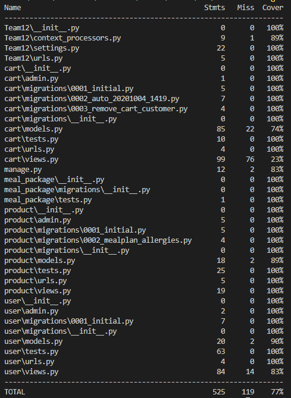

# T-302-HONN Team12


---
## Collaborators

- Bjarki Már Friðriksson
- Elmar Ólafsson
- Fannar Leó Örvarsson
- Garpur Hnefill Emilíuson
- Gunnlaugur Hlynur Birgisson
- Hrafnkell Þorri Þrastarson
- Valgeir Ingi Þórðarson
- Ýmir Þórleifsson

---
## Description of the project
The project is a website, developed in Django, for users to easily buy meal packages containing groceries. Similar to Eldum Rétt or Blue Apron, the service will send ingredients to a customer periodically, e.g. on a weekly basis or more often.

---
## Sprints

### Sprint 1
We decided on building the website with Django as framework connected to a Postgres as database. Possibly using Atomic for the UI in the future. We are currently using built-in models, admin and users. As of now, the website contains functionality for users to register, login, look at their profile, logout and delete their account.

#### Encapsulation
Django has some form of encapsulation where the models provide classes that consist of data and methods that have been bundled into a single unit, and the views can create instances of those classes. However, it can often happen that Django developers end up splitting logic across both the model code and the view code, thus breaking the encapsulation that the model class should provide.

#### Inheritance
In our software, all our models inherit from the Model base class from the models module (models.Model).

#### Polymorphism
As our software represents an e-commerce website, polymorphism is depicted in several ways including, user creation and when user's cart includes product/s. When a user is created the model requires different information about the user (e.g. username, email etc.). Therefore, the user object can take on many forms. Same thing goes for the user's cart, which the user can add different products to his cart.

#### Abstract classes
We are currently not using any abstract classes in our software.

---
### Sprint 2
We decided on wanting to implement two critical components to the website; viewing of products and online shopping. We used the RESTful API architecture to display the products. But making the online shopping was more diffcult than we thought, 6 models needed to be implemented for the database. But we managed to create the views and get it up and running.

---
### Sprint 3
The team decided to focus more in this sprint on getting the tests up and running, as it had been a huge headache for quite some time, as well as the lecture aspects. We finally managed to fix the testing issues and added some nice features as well. Sketching up all the diagrams went rather smoothly, except for the delivery diagram, as it proved to be fairly difficult finding an example of such online or in the textbook.

#### Dependency injection

When adding meal package to the cart, the add(request) method in src/Team12/cart/views.py has a setter injection which is used when setting the customer. The variable customer is set with the correct User object, which represents the customer who is adding a meal package to his cart.

#### Single Responsibility Principle

The function detailed_product() has the single responisibility of sending out details on a product to a template  
The function cancelSubscription() has the single responsibility of canceling any subscription  
The function editProfileRedirect() has the single responsibility if redirecting to an edit profile template  
The function edit_quantity() has the single responsibility of recieving a number and changing the quantity of a product in the cart

---
### Sprint 4

#### Conway's law

As Conway's law states: ,,Any organization that designs a system (defined broadly) will produce a design whose structure is a copy of the organization's communication structure.".

Therefore, as our software is structured in a layered architecture, our communication structure would have certain team/s working on a particular layer, whether it is the presentation layer, the logic layer or the data layer.

This is not really the case in our project. While this show in some extend, where some team members tend to work only in one layer of the software, but more often that not team members work across all layers, i.e. from the presentation layer to the data layer.


#### Identifying Components

One of the components that we identified was the django user. The user comes equiped with some nice features like a simple log in system that can be improved upon depending on
your needs, the user can be completely replaced by a new system but we decided on using it as we didin't notice any downsides. 
So in conclusion user is both independently replaceable and upgradable.

The next component identified was the postgres database. We decided on using it since most of us used it recently. it proved to be very simple apart from testing issued which 
was caused by our hosting service. The postgres database in it self can be independently replaced but not upgraded.


#### Non-functional requirments

See non-func-requirements.pdf

#### Constraints

<strong>1) Two-week deadline for each sprint</strong>

Addressed by: The team is well organised by using Asana, where every sprint is planned thoroughly for maximum efficiency.

<strong>2) Some team members inexperienced with the framework</strong>

Addressed by: Those team members search for knowledge about that particular framework through e.g. video tutorials or article online. The team also tries to use pair programming as much as possible where more inexperienced team members are paired with more experienced ones.

<strong>3) Database can only have max 5 concurrent connections</strong>

Addressed by: The team tries to balance the load on the database with good communications on Discord.

<strong>4) No in-person meetings due to Covid-19</strong>

Addressed by: The team uses Discord for all team communications and meetings and Google Meet for meetings with the TA.

#### Risk management analysis

See risk-management.pdf

#### Logging
We have completely overlooked logging so far in the development, we have been using the default django error handling for error information.
We would like to add logging to the followong components: Register, Login, Add to Cart, Remove from Cart, View Product.  This would be done with django's build in logging module that would write all logging from the logger to a local file.  This module provides a lot of functionality and flexibility and the key benefit of having the logging provided by a library module is that all modules can participate in logging, so our application log can include our own messages integrated with messages from third-party modules.

---
## Software architecture

Our software is designed in well defined layers; Presentation Layer, Logic Layer and Data Layer.


We are using Django to develop both the PL and LL. In the PL we use Django templates, that use HTML and CSS along with a bit of Python. In the LL we only use Python to build Django views, that decide on templates to show user. We also build Django models, that decide what and how data is stored.

The data layer is stored in SQL using Postgres, we store our models in SQL table format.

---
## How to run
Have [Python 3.8](https://www.python.org/downloads/) and [pip](https://bootstrap.pypa.io/get-pip.py) installed. In the root directory, Team12, open the shell. 
```
> pip install pipenv
> pipenv install
```
Now run the server
```
> cd src\Team12
> py manage.py runserver
```
Now you can visit our [website](http://localhost:8000).
```
First thing you need to do is create a customer model
1. Create an account
2. Go to profile and click "Edit Profile"
3. Fill in all the fields
4. Now you can freely use the website

```
---
### How to download `pip.py`

Download [pip](https://bootstrap.pypa.io/get-pip.py). 
Open the shell where `get-pip.py` was downloaded.

```
> python get-pip.py
```
---


## Testing

### How to test
IMPORTANT: if the user wishes to run the tests, then he has to do so on a local database
our elephantSQL database does not allow us to run tests as we are not granted the permission to
create a dummy database for running the tests

```
> python manage.py test
# or for the coverage run 
> coverage run manage.py test
```

### Converting to a local database

If you want to run the tests you most likely have to run them on a local database.
to do so you have to modify the settings.py file to like like the image above.
The next step is migrating to the database with is done with the function

```
> python makemigrations
# and then run
> python migrate
```

If there are any migration issues delete all the migration files found in each app and then try again
also this function helps when collsions occur

```
> python manage.py migrate --fake
```

Make sure to insert a postgres superuser info into the settings.py, then the test should be runnable with the commands 
found in the paragraph above. 


### Coverage Report	


As it can be seen above, all our apps are almost completely coved by the test.
For a more detailed report check the htmlcov located in src/team12/htmlcov.
All that remains to be tested as of writing this, is the cart views. 


## Design Patterns

We utilized 6 design patterns in sprint 2 which are listed below:
<ul>
    <li>The user accesses the meal packages via a registry (database).
	The meal package database feeds information that can be displayed. 
	However, it can also be accessed by search and sort interfaces.</li>
    <li>The meal packages themselves are value objects and their prices can be compared.
	They are individually defined and have a few attributes.
	However, they are used by the user when viewing, selecting and purchasing.</li>
    <li>The selected delivery time of an order is represented by a service stub.
	External factors influence available time slots, e.g. the number of prepping and delivery staff as well as the number of deliveries on a given day.</li>
    <li>Delivery place is an example of a gateway.
	The delivery gateway is gets information such as the user's location and cart contents, and returns available delivery locations.</li>
    <li>The sorting implementation for the meal packages is a seperated interface.
	It is dependant on the data interface but other parts can also access the data irrespective of the sort.</li>
    <li>The meal packages that users see displayed are managed by a mapper.
	The admininstrator can see and edit the packages which are then displayed to users if available.</li>
</ul>

## Screenshots
<table>
    <tr>
        <th>
            Homepage
            
        </th>
        <th>
            Profile Page
            
        </th>
        <th>
            Product Page
            
        </th>
    </tr>
    <tr> 
        <th>
            Product Detailed
            
        </th>
        <th>
            Cart Page
            
        </th>
    </tr>
</table>
